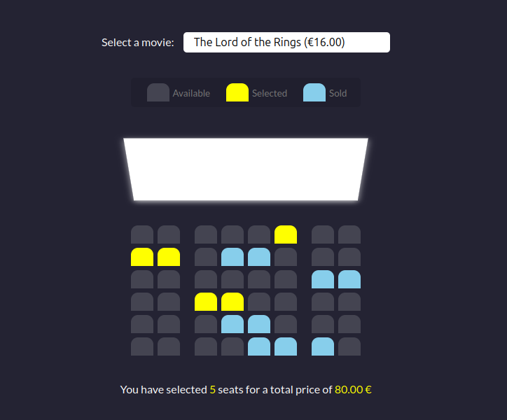

# Movie Seat Booking System

A responsive movie seat booking interface that allows users to select seats and see real-time pricing updates based on their choices.

## Features
- **Select a movie** from a dropdown menu
- **Choose available seats** (selected seats turn yellow)
- **See real-time total price updates** in Euros (€)
- **Fully responsive design** for mobile and desktop
- **Uses JavaScript, HTML, and CSS** for interactivity

## Snapshot


## How to Run
1. Clone the repository:
   ```sh
   git clone https://github.com/yourusername/movie-seat-booking.git
   ```
2. Open `index.html` in your browser.

## Technologies Used
- HTML5
- CSS3 (Flexbox & Grid for layout)
- JavaScript (DOM manipulation, local storage)


